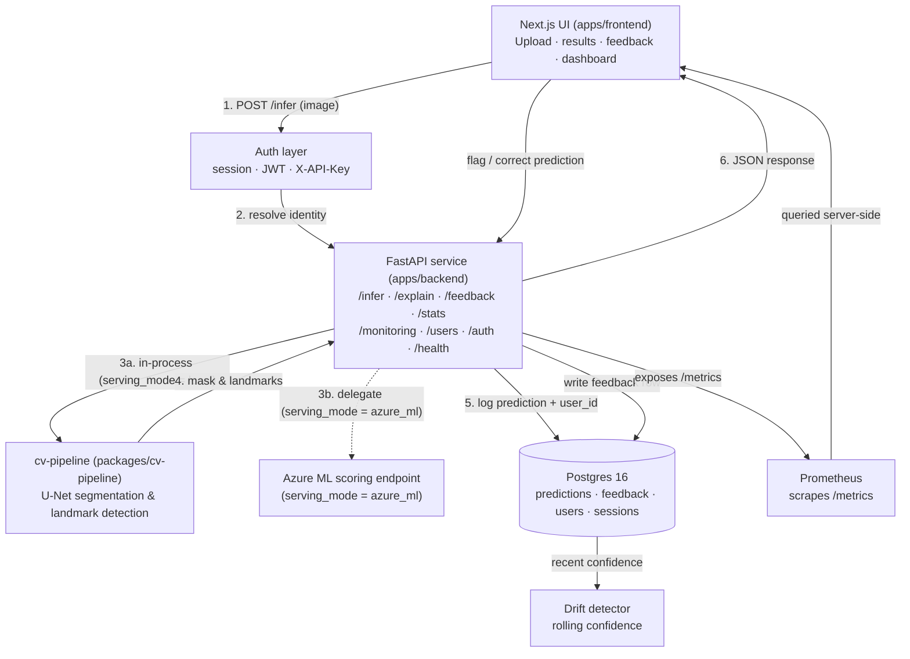
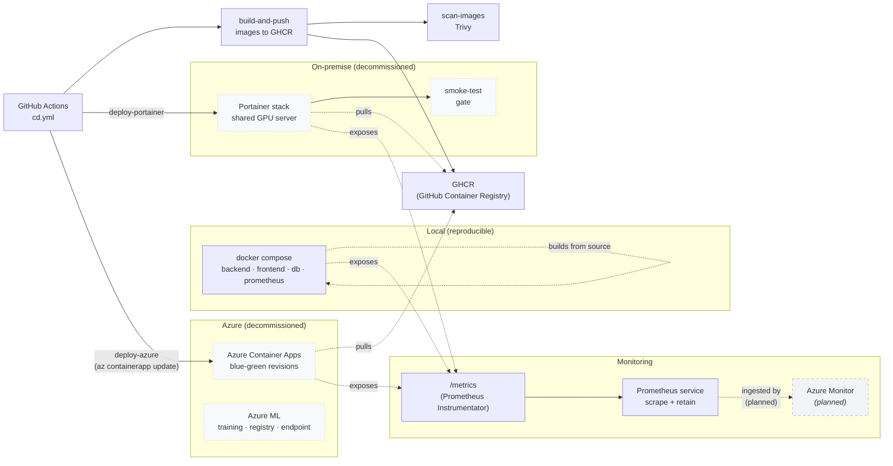
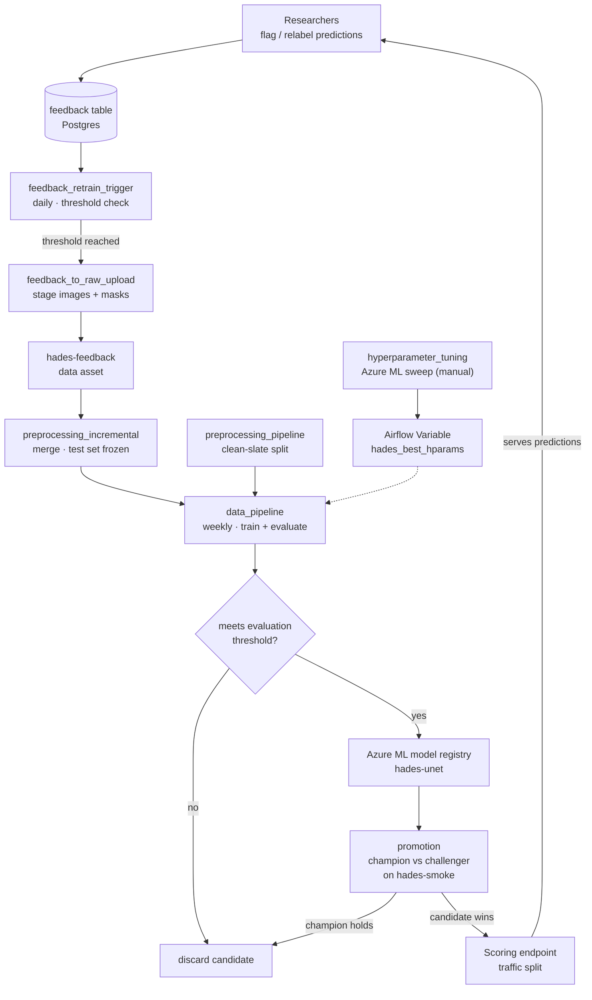

# Architecture

Three views of the system: how a request flows through it, how it is
built and deployed, and how it retrains itself.

Diagrams render as Mermaid on GitHub. For the reasoning behind these
choices — why FastAPI, why U-Net, why patch-based inference — see the
architecture page in the documentation site.

---

## System

Data flow for a single inference request, plus the feedback write-path
that feeds retraining.

Both serving modes return the same response schema, so a client cannot
tell them apart from the payload. Anonymous callers are allowed on
`/infer`; the prediction is stored with a null user id.

---

## Deployment

From a merge on `main` to running containers, and the monitoring path.

The same four services run everywhere: backend, frontend, Postgres, and
Prometheus. Only the orchestrator changes — Compose locally, a Portainer
stack on-premise, Container Apps in cloud.

Rollout to cloud used blue-green revisions: a new revision is created at
zero traffic, health-checked, and only then given a traffic split. On
on-premise, `smoke-test` runs against the deployed stack and a failure
leaves the previous containers serving.

:::{note}
The on-premise and Azure environments were provisioned for a university
project and have been decommissioned. Their definitions are preserved
in `infra/` as the production deployment layer; the local Compose stack
is the reproducible path.
:::

---

## MLOps retraining loop

The loop closes: user corrections become training data, a candidate is
trained and evaluated, and it only reaches production after beating the
model currently serving.

Two triggers drive retraining, whichever comes first: `data_pipeline`
runs weekly on a schedule, and `feedback_retrain_trigger` fires the
feedback bridge once accumulated corrections cross a configured
threshold.

`preprocessing_incremental` keeps the test set frozen while re-splitting
train and validation, so models stay comparable across versions.
`preprocessing_pipeline` is the clean-slate alternative for a fresh
dataset.

Registration is conditional — a candidate enters the registry only if it
clears the evaluation gate on a held-out test set. Promotion is a second,
independent gate: `promotion.py` scores the candidate against the current
champion on the `hades-smoke` asset and only then flips endpoint traffic.

### DAG inventory

| DAG | Schedule | Purpose |
|---|---|---|
| `data_pipeline` | Weekly (Mon 02:00) | Train, evaluate, conditionally register |
| `preprocessing_pipeline` | Manual / scheduled | Clean-slate preprocessing and split |
| `preprocessing_incremental` | Triggered | Merge new data, frozen test set |
| `hyperparameter_tuning` | Manual | Azure ML sweep, writes winning hparams |
| `feedback_retrain_trigger` | Daily | Fire the bridge on threshold |
| `feedback_to_raw_upload` | Triggered | Feedback to registered data asset |
