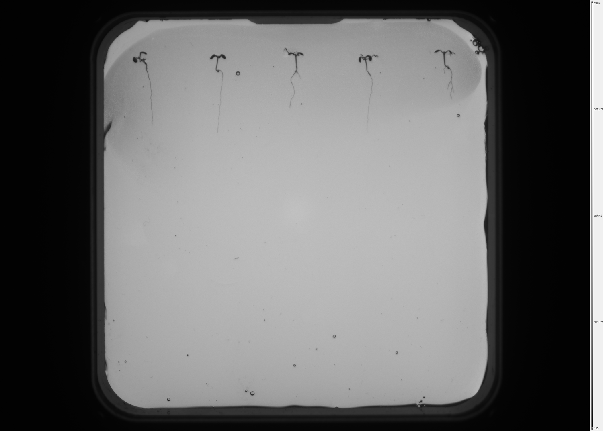
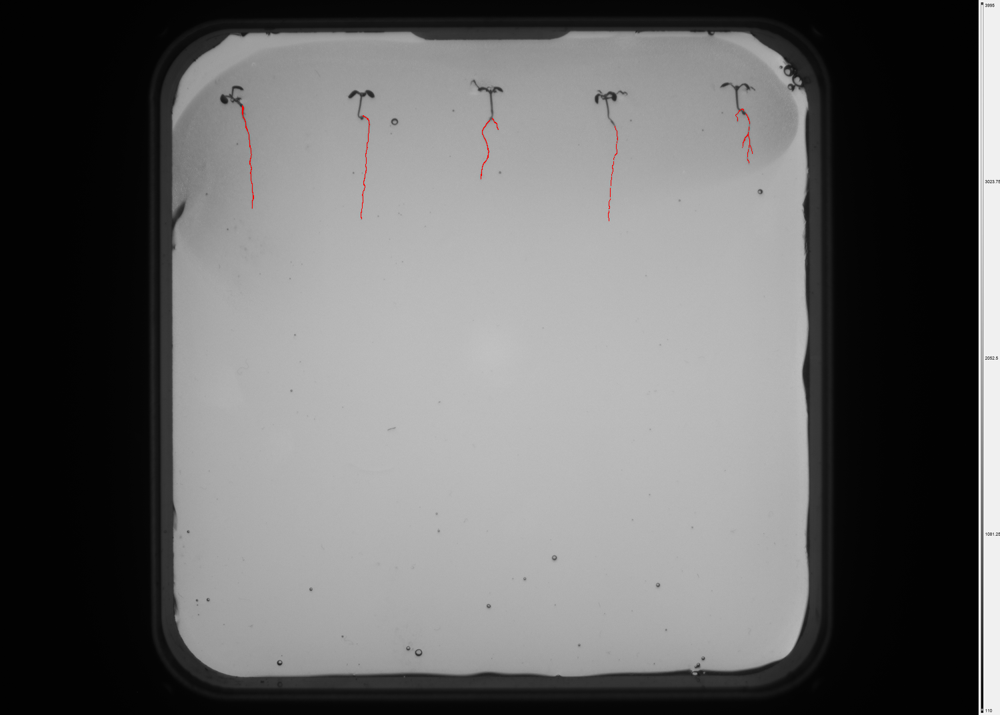

# Quick start: your first inference in 5 minutes

:::{note}
This is a **tutorial**. You will be guided through a complete worked
example with all commands to run and what to expect. If you already
know what you're doing and just need syntax, go to
[How-to guides](../how-to/index).
:::

By the end of this tutorial you will have:

1. Cloned the repo and installed dependencies.
2. Run the CLI on a sample image.
3. Inspected the mask and landmarks output.
4. Called the same pipeline through the HTTP API.

You do not need a GPU. Inference on CPU is slower (about 20 seconds
for a 640x640 image) but works exactly the same.

## Prerequisites

- Python 3.11.9
- [`uv`](https://docs.astral.sh/uv/) 0.5 or newer
- git
- (Optional) Docker Desktop if you want to try the full stack later

## Step 1 - Clone and install

```bash
git clone https://github.com/filipp-lotsmanov/root-inoculation-mlops.git
cd root-inoculation-mlops
uv sync
```

The first `uv sync` downloads PyTorch and takes 2-3 minutes. Subsequent
runs are cached and take under 10 seconds.

## Step 2 - Get the model weights

The trained U-Net checkpoint is not stored in the repo (it's 180 MB).
The pipeline downloads it automatically the first time you run
inference. To trigger the download explicitly:

```python
from cv_pipeline.weights import get_weights
get_weights("unet-v1")
# Saved to ~/.cache/cv-pipeline/models/unet-v1.pth
```

The file is cached under `~/.cache/cv-pipeline/models/` (override
with the `CV_PIPELINE_CACHE_DIR` environment variable). Subsequent
runs reuse the cached file - no re-download.

## Step 3 - Run your first inference

The sample images used in this tutorial ship with the documentation at
`docs/source/_static/sample_plate.png`. Copy it somewhere convenient
or use any `.png`/`.tif` image of your own:

```bash
uv run cv-pipeline infer \
    --image docs/source/_static/sample_plate.png \
    --output results/
```

:::{note}
Step 2 is optional. By default, this command uses the `unet-v1`
model, and if its weights are not already cached they will be
downloaded automatically on first run.
:::

You should see:

```
Inference complete: 2 landmark(s) detected.
  Result: results/sample_plate_result.json
  Mask:   results/sample_plate_mask.png
```

## Step 4 - Inspect the output

Open `results/sample_plate_mask.png` - it's a black-and-white image
the same size as the input. White pixels mark predicted root tissue.

### Visual example

Below: an NPEC plant image and the same image overlaid with the
pipeline's prediction. Red traces mark the predicted root
segmentation. The pipeline only segments roots - shoots and
seeds are out of scope for this package.

:::{list-table}
:header-rows: 1
:widths: 50 50

* - Input image
  - Root segmentation overlay
* - 
  - 
:::

:::{note}
The sample files `docs/source/_static/sample_plate.png` and
`docs/source/_static/sample_mask.png` ship with this repository.
The plate image is `train_Alican_244760_im1.png` from the BUas
Y2B_25 dataset; the overlay shows the corresponding ground-truth
root annotation. Both downscaled from 4202x3006 px to 1500x1073 px
for web delivery. Used with permission of BUas/NPEC for
documentation purposes.
:::

### Inspect the result JSON

Open `results/sample_plate_result.json` in any editor. You'll see:

```json
{
  "pipeline_version": "0.1.0",
  "model_version": "unet-v1",
  "timestamp": "2026-04-22T14:03:19+00:00",
  "image_filename": "sample_plate.png",
  "image_width_px": 1500,
  "image_height_px": 1073,
  "mask_b64": "<base64-encoded PNG>",
  "mask_confidence": 0.78,
  "landmark_count": 2,
  "landmarks": [
    {"id": 0, "x": 128, "y": 85, "confidence": 0.91},
    {"id": 1, "x": 134, "y": 172, "confidence": 0.86}
  ],
  "metadata": {...}
}
```

The `landmarks` array holds detected root tips in pixel coordinates.
`mask_confidence` is the mean probability across the mask - low values
(<0.6) mean the pipeline isn't sure about the overall segmentation.

## Step 5 - Call the same code through the API

:::{important}
The API requires a running database. The easiest way to get the
full stack (backend + frontend + Postgres) is Docker Compose. The
seed script runs automatically on first startup and creates default
users from the `API_KEY` and `ADMIN_API_KEY` environment variables.
**You must set these before the first start** - the seed is
idempotent and skipped on subsequent restarts.
:::

### 5.1 Configure environment variables

Copy the env template and fill in the required values:

```bash
cp configs/env/env.example configs/env/.env
```

Edit `configs/env/.env` and set:

```
API_KEY=<32-character-hex-string-of-your-choice>
ADMIN_API_KEY=<another-32-character-hex-string>
POSTGRES_PASSWORD=<any-password-for-the-local-db>
```

To generate keys on Linux/macOS:

```bash
openssl rand -hex 32
```

To generate keys on Windows PowerShell:

```powershell
-join ((1..64) | ForEach-Object { '{0:x}' -f (Get-Random -Maximum 16) })
```

### 5.2 Start the full stack

```bash
cd infra/local
docker compose up --build
```

On first startup you should see the backend container run migrations
and then:

```
INFO: Seeded default researcher and admin users.
```

Wait until the health check passes and you see `Uvicorn running on
http://0.0.0.0:8000`. The frontend is available at
<http://localhost:3000> and the API at <http://localhost:8000/docs>.

### 5.3 Make an authenticated request

Open a second terminal from the repo root:

```bash
export API_KEY=$(grep ^API_KEY= configs/env/.env | cut -d= -f2)

curl -X POST http://localhost:8000/infer \
    -H "X-API-Key: $API_KEY" \
    -F "image=@docs/source/_static/sample_plate.png" \
    | python -m json.tool
```

PowerShell equivalent:

```powershell
$env:API_KEY = (Get-Content configs/env/.env | Select-String '^API_KEY=').ToString().Split('=')[1]

curl.exe -X POST http://localhost:8000/infer `
    -H "X-API-Key: $env:API_KEY" `
    -F "image=@docs/source/_static/sample_plate.png" `
    | python -m json.tool
```

The response body is identical to the CLI's `result.json`. The API
and the CLI share the same pipeline - there is only one code path.

To stop the stack, press `Ctrl+C` in the compose terminal or run
`docker compose down` from `infra/local/`. Add `-v` to also wipe
the database volume.

## What next

- Learn to call the API from Python, curl, or the Next.js frontend:
  {doc}`../how-to/call-the-api`
- Understand how error codes work:
  {doc}`../explanation/error-codes`
- Register a new model version:
  {doc}`../how-to/add-a-new-model-version`

## Troubleshooting

**"`ModuleNotFoundError: No module named 'cv_pipeline'`"**
You ran `python` instead of `uv run python`. Everything must go
through `uv run` unless you've activated the venv manually.

**"`MODEL_NOT_READY`"**
The weights download failed or the cache is corrupted. Re-trigger the
download with `from cv_pipeline.weights import get_weights; get_weights("unet-v1")`,
or pass `--version unet-v1` explicitly to re-attempt.

**"`IMAGE_TOO_SMALL`"**
Your image is under 256x256. The pipeline requires at least that
size - see {doc}`../explanation/error-codes` for the full list.

**"`UNAUTHORIZED`" even though I set API_KEY**
The seed script ran with different keys than the ones in your current
`.env`. Either clear the users table (`docker compose exec db psql -U
cvuser -d cvdb -c "TRUNCATE users CASCADE;"`) and restart the backend, or
use the keys from when the database was first initialised.
